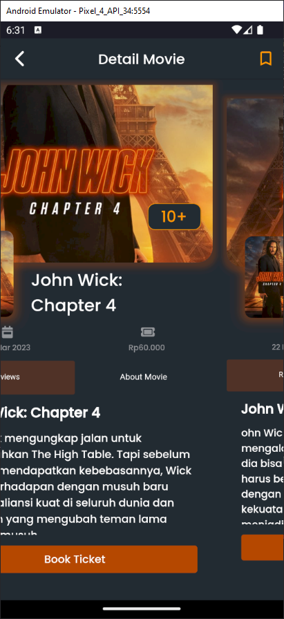
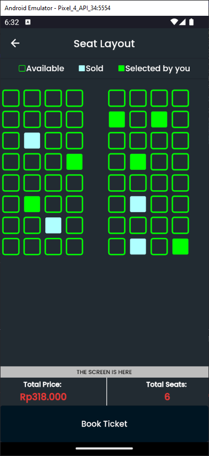
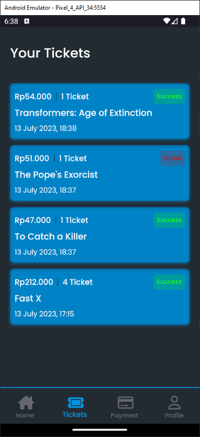
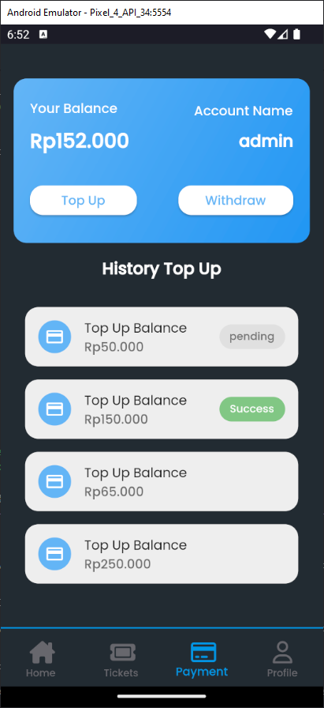

<h1 align="center">
  SEA Cinema
</h1>
<p align="center">
  Seamless Cinema Experience at Your Fingertips.
</p>
<p align="center">
  <a href="https://flutter.dev/"></a>
  <a href="https://dart.dev/"></a>
  <a href="https://github.com/codeyzx/sea-cinema/"></a>
</p>

<p align="center">
  
</p>

## Table of Contents

- [Getting Started](#getting-started)
- [Demo](#demo)
- [Features](#features)
- [Dependencies](#dependencies)

## Getting Started

1. Ensure you have Flutter installed on your machine.

2. Clone the repository:

```
git clone https://github.com/codeyzx/sea-cinema.git
```

3. Navigate to the project directory:

```
cd sea-cinema
```

4. Retrieve the project dependencies by running the following command:

```
flutter pub get
```

5. Set up environment variables:

- Create a `.env` file in the root directory.
- Add the following environment variables to the `.env` file:

  ```
  BASE_URL=https://seleksi-sea-2023.vercel.app/api
  BASE_URL_SEA=https://sea-cinema.up.railway.app
  API_KEY=YOUR_API_KEY
  SERVER_KEY=YOUR_MIDTRANS_SERVER_KEY
  CLIENT_KEY=YOUR_MIDTRANS_CLIENT_KEY
  ```

  Replace `API_KEY`, `YOUR_MIDTRANS_SERVER_KEY`, `YOUR_MIDTRANS_CLIENT_KEY`. with your actual Midtrans API credentials and IMDb API credentials.

6. Connect a physical device or start an emulator.

7. Run the application:

```
flutter run
```

## Demo

| Movies                | Booking               |
| --------------------- | --------------------- |
|   |  |
| Tickets               | Payment               |
|  |  |

## Features

- Splash
- Authentication
- List Movies
- Movie Detail
- Swipeable Movie Cards
- Book Tickets
- Top Up
- Top Up with Midtrans
- Withdraw
- Watchlist
- Edit Profile

## Dependencies

- [Cached Network Image](https://pub.dev/packages/cached_network_image)
- [Card Swiper](https://pub.dev/packages/card_swiper)
- [Cloud Firestore](https://pub.dev/packages/cloud_firestore)
- [Cupertino Icons](https://pub.dev/packages/cupertino_icons)
- [Dio](https://pub.dev/packages/dio)
- [Firebase Auth](https://pub.dev/packages/firebase_auth)
- [Firebase Core](https://pub.dev/packages/firebase_core)
- [Flutter](https://flutter.dev)
- [Flutter Animate](https://pub.dev/packages/flutter_animate)
- [Flutter Dotenv](https://pub.dev/packages/flutter_dotenv)
- [Flutter Screenutil](https://pub.dev/packages/flutter_screenutil)
- [Flutter SVG](https://pub.dev/packages/flutter_svg)
- [Font Awesome Flutter](https://pub.dev/packages/font_awesome_flutter)
- [FPDart](https://pub.dev/packages/fpdart)
- [Freezed](https://pub.dev/packages/freezed)
- [Freezed Annotation](https://pub.dev/packages/freezed_annotation)
- [Go Router](https://pub.dev/packages/go_router)
- [Hexcolor](https://pub.dev/packages/hexcolor)
- [Hooks Riverpod](https://pub.dev/packages/hooks_riverpod)
- [Intl](https://pub.dev/packages/intl)
- [JSON Annotation](https://pub.dev/packages/json_annotation)
- [Logger](https://pub.dev/packages/logger)
- [Midtrans SDK](https://pub.dev/packages/midtrans_sdk)
- [Palette Generator](https://pub.dev/packages/palette_generator)
- [Quickalert](https://pub.dev/packages/quickalert)
- [Riverpod Lint](https://pub.dev/packages/riverpod_lint)
